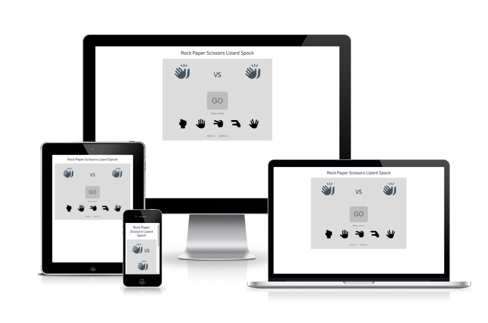
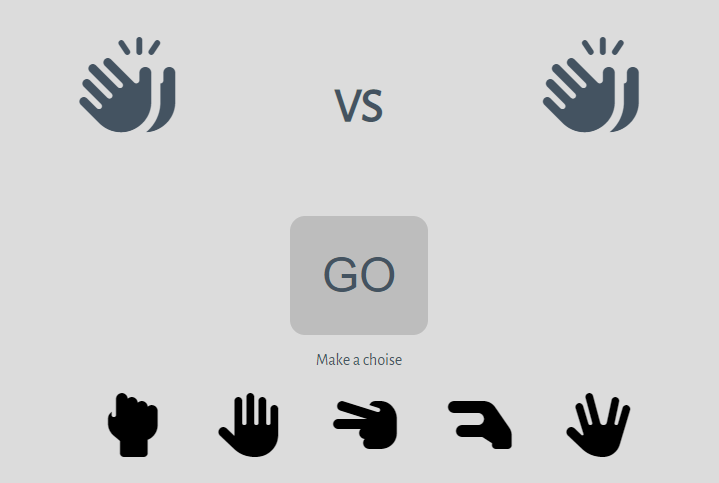

# Rock Paper Scissors Lizard Spock

Rock Paper Scissors Lizard Spock is a game that hopes to keep the player entertained with a more advanced version of the classic Rock Paper Scissors game.
You can read more about the rules and where it comes from [here](https://bigbangtheory.fandom.com/wiki/Rock,_Paper,_Scissors,_Lizard,_Spock).

## Features 

### Existing Features

- __Header__

  - The header displays the name of the game and the page.

- __Game Area__

  - This section of the game displays the gameboard.
  - Allows you to choose a hand.
  - Allows you to play against the computer.
  - You can see whether you win or loose.
  - You can see what hand the computer has choosen.

- __Score Area__

  - This area on the gameboard allows you to see the current score. 
  - Displays wins, losses and also draws.

### Features Left to Implement

  - Player vs Player.

## Testing 

  - During the development there was a bug that counted draws as losses. This was fixed by adding 1 more score section for draws and in the evaluate function it was added to se if the player hand and the computer hand was the same.
  - Tested all the buttons to see that they work.
  - Tested the to see if  the page is responsive and fits all screen sizes.

### Validator Testing 

- HTML
  - No errors were returned when passing through the official [W3C HTML validator](https://validator.w3.org/nu/?doc=https%3A%2F%2Fmattias-b-pettersson.github.io%2FRockPaperScissorsLizardSpock-Game%2F). 
  - There is a warning for a empty heading, but this heading is filled with javascript while playing the game.
- CSS
  - No errors were found when passing through the official [(Jigsaw) CSS validator](https://jigsaw.w3.org/css-validator/validator?uri=https%3A%2F%2Fmattias-b-pettersson.github.io%2FRockPaperScissorsLizardSpock-Game%2F&profile=css3svg&usermedium=all&warning=1&vextwarning=&lang=sv)

### Unfixed Bugs

  - There are no known bugs.

## Deployment

- The site was deployed to GitHub pages. The steps to deploy are as follows: 
  - In the GitHub repository, navigate to the Settings tab 
  - From the source section drop-down menu, select the Master Branch
  - Once the master branch has been selected, the page will be automatically refreshed with a detailed ribbon display to indicate the successful deployment. 

The live link can be found here - https://mattias-b-pettersson.github.io/RockPaperScissorsLizardSpock-Game/

## Credits 

- The ruleslink in the about section is from https://bigbangtheory.fandom.com/wiki/Rock,_Paper,_Scissors,_Lizard,_Spock
- The icons were taken from [Font Awesome](https://fontawesome.com/)
- The fonts used are from [google Fonts](https://fonts.google.com/)